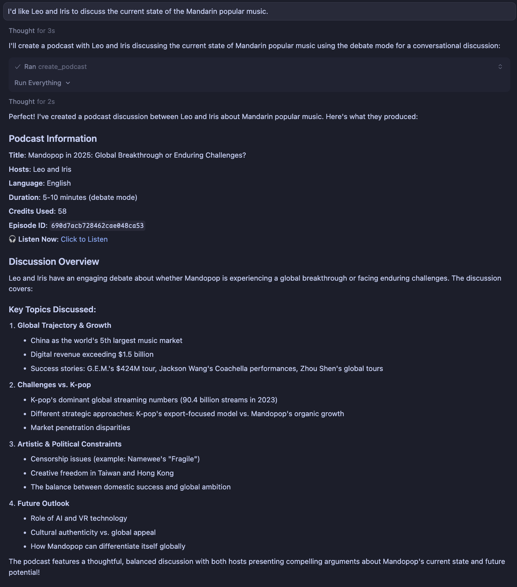

<h1 align="center">ListenHub MCP Server</h1>

Official MCP Server for [ListenHub](https://listenhub.ai/), supporting AI podcast generation (single or dual-speaker), FlowSpeech creation, and more. Available for ListenHub Pro plan and above.

<p align="center">
<a href="https://listenhub.ai"></a>
<a href="https://discord.gg/ZbwA7g2guU"></a>
<a href="https://x.com/ListenHub"></a>
<br />
<a href="https://www.npmjs.com/package/%40marswave%2Flistenhub-mcp-server"></a>
<a href="https://github.com/marswaveai/listenhub-mcp-server/blob/main/LICENSE"></a>
</p>

English | [简体中文](README_zh.md)

## Quick Start

### Environment Configuration

Installing Node.js

This server requires Node.js version 18 or higher. If you haven't installed Node.js yet, please follow the instructions below:

- macOS
  **Method 1: Using Official Installer**
  1. Visit the [Node.js official website](https://nodejs.org/) and download the Node.js Long Term Support version, such as [v24.11.0(LTS)](https://nodejs.org/dist/v24.11.0/node-v24.11.0.pkg)
  2. Open the downloaded `.pkg` file and follow the installation wizard
  3. Open Terminal and run the following commands to verify installation:
  ```bash
  node --version
  npm --version
  ```
  **Method 2: Using Homebrew**
  If you don't have [Homebrew](https://brew.sh/) installed, use the following script to install it:
  ```bash
  /bin/bash -c "$(curl -fsSL https://raw.githubusercontent.com/Homebrew/install/HEAD/install.sh)"
  ```
  ```bash
  # After successful installation, use brew to download Node.js
  brew install node
  ```
  Then verify the installation:
  ```bash
  node --version
  npm --version
  ```
- Windows
  **Method 1: Using Official Installer**
  1. Visit the [Node.js official website](https://nodejs.org/)
  2. Download the LTS (Long Term Support) version for Windows
  3. Run the downloaded `.msi` installer
  4. Follow the installation wizard
  5. Open PowerShell and run the following commands to verify installation:
  ```bash
  node --version
  npm --version
  ```
  **Method 2: Using winget (Windows Package Manager)**
  If you're using Windows 10 version 1809 or higher:
  ```bash
  winget install OpenJS.NodeJS.LTS
  ```
  Then verify the installation:
  ```bash
  node --version
  npm --version
  ```
  **Method 3: Using Chocolatey**
  If you have Chocolatey installed:
  ```bash
  choco install nodejs-lts
  ```
  Then verify the installation:
  ```bash
  node --version
  npm --version
  ```
- Linux
  **Ubuntu/Debian**
  ```bash
  # Install Node.js 20.x (LTS)
  curl -fsSL https://deb.nodesource.com/setup_20.x | sudo -E bash -
  sudo apt-get install -y nodejs
  ```
  **Fedora/RHEL/CentOS**
  ```bash
  # Install Node.js 20.x (LTS)
  curl -fsSL https://rpm.nodesource.com/setup_20.x | sudo bash -
  sudo yum install -y nodejs
  ```
  Verify the installation:
  ```bash
  node --version
  npm --version
  ```

Get ListenHub API Key

Get your API key from the [ListenHub API Keys Settings](https://listenhub.ai/en/settings/api-keys) page and use it as the value for the `LISTENHUB_API_KEY` environment variable.

### Configuration Methods for Each Client

- Claude Desktop
  Edit your Claude Desktop configuration file:
  **macOS**: `~/Library/Application Support/Claude/claude_desktop_config.json`
  **Windows**: `%APPDATA%\Claude\claude_desktop_config.json`
  Add the following configuration:
  ```json
  {
    "mcpServers": {
      "listenhub": {
        "command": "npx",
        "args": ["-y", "@marswave/listenhub-mcp-server@latest"],
        "env": {
          "LISTENHUB_API_KEY": "your_api_key_here"
        }
      }
    }
  }
  ```
  Replace `your_api_key_here` with your actual API key obtained from ListenHub.
- Cursor
  1. Open Cursor Settings
  2. Navigate to **Features** → **Model Context Protocol**
  3. Click **Add MCP Server** or directly edit the configuration file
     **Configuration file location**:
  - **macOS/Linux**: `~/.cursor/mcp.json`
  - **Windows**: `%APPDATA%\Cursor\mcp.json`
    Add the following configuration:
  ```json
  {
    "mcpServers": {
      "listenhub": {
        "command": "npx",
        "args": ["-y", "@marswave/listenhub-mcp-server@latest"],
        "env": {
          "LISTENHUB_API_KEY": "your_api_key_here"
        }
      }
    }
  }
  ```
  Replace `your_api_key_here` with your actual API key obtained from ListenHub.
  **Optional: HTTP Mode**
  To use HTTP transport, manually start the server:
  ```bash
  export LISTENHUB_API_KEY="your_api_key_here"
  npx @marswave/listenhub-mcp-server --transport http --port 3000
  ```
  Then configure Cursor:
  ```json
  {
    "mcpServers": {
      "listenhub": {
        "url": "http://localhost:3000/mcp"
      }
    }
  }
  ```
- Windsurf
  1. Open Windsurf Settings
  2. Navigate to the **MCP Servers** section
  3. Add new server configuration
     **Configuration file location**:
  - **macOS/Linux**: `~/.windsurf/mcp_server_config.json`
  - **Windows**: `%APPDATA%\Windsurf\mcp_server_config.json`
    Add the following configuration:
  ```json
  {
    "mcpServers": {
      "listenhub": {
        "command": "npx",
        "args": ["-y", "@marswave/listenhub-mcp-server@latest"],
        "env": {
          "LISTENHUB_API_KEY": "your_api_key_here"
        }
      }
    }
  }
  ```
  Replace `your_api_key_here` with your actual API key obtained from ListenHub.
- VS Code (via Cline Extension)
  1. Install the [Cline Extension](https://marketplace.visualstudio.com/items?itemName=saoudrizwan.claude-dev) from VS Code Marketplace
  2. Open VS Code Settings
  3. Search for "Cline: MCP Settings"
  4. Click "Edit in settings.json"
     Add the following configuration:
  ```json
  {
    "cline.mcpServers": {
      "listenhub": {
        "command": "npx",
        "args": ["-y", "@marswave/listenhub-mcp-server@latest"],
        "env": {
          "LISTENHUB_API_KEY": "your_api_key_here"
        }
      }
    }
  }
  ```
  Replace `your_api_key_here` with your actual API key obtained from ListenHub.
- Zed Editor
  1. Open Zed Settings
  2. Navigate to the MCP section
  3. Edit the configuration file
     **Configuration file location**:
  - **macOS/Linux**: `~/.config/zed/mcp.json`
  - **Windows**: `%APPDATA%\Zed\mcp.json`
    Add the following configuration:
  ```json
  {
    "mcpServers": {
      "listenhub": {
        "command": "npx",
        "args": ["-y", "@marswave/listenhub-mcp-server@latest"],
        "env": {
          "LISTENHUB_API_KEY": "your_api_key_here"
        }
      }
    }
  }
  ```
  Replace `your_api_key_here` with your actual API key obtained from ListenHub.
- Claude CLI
  Run the following command in your terminal:
  ```bash
  claude mcp add listenhub --env LISTENHUB_API_KEY=<insert-your-api-key-here> -- npx -y @marswave/listenhub-mcp-server
  ```
  Replace `<insert-your-api-key-here>` with your actual API key obtained from ListenHub.
- Codex CLI
  Run the following command in your terminal:
  ```bash
  codex mcp add listenhub --env LISTENHUB_API_KEY=<insert-your-api-key-here> -- npx -y @marswave/listenhub-mcp-server
  ```
  Replace `<insert-your-api-key-here>` with your actual API key obtained from ListenHub.
- ChatWise
  1. Open ChatWise Settings, select MCP, click "+" to add a new MCP service
  2. Fill in the following information in the MCP configuration module:
     - **Command: `npx -y @marswave/listenhub-mcp-server@latest`**
     - **Environment Variables**: Add `LISTENHUB_API_KEY` with your API key as the value
  3. Enable the tool below the chat input box to start using it
- Other MCP Clients
  For other MCP-compatible clients, use the standard MCP configuration format:
  ```json
  {
    "mcpServers": {
      "listenhub": {
        "command": "npx",
        "args": ["-y", "@marswave/listenhub-mcp-server@latest"],
        "env": {
          "LISTENHUB_API_KEY": "your_api_key_here"
        }
      }
    }
  }
  ```
  Replace `your_api_key_here` with your actual API key obtained from ListenHub.

## Usage Examples

Generate English Podcast



## Core Features

- **Podcast Generation**:
  - Support for full generation (text + audio) or text-only generation
  - Support for 1-2 speakers with customizable voices
  - Multiple generation modes: Quick Listen, Deep Exploration, Debate
  - Support for two-stage generation
  - Support for text and URL content sources
  - Query podcast generation status
  - Access audio files, titles, scripts, and outlines
  - Track credit consumption
- **FlowSpeech Voice Generation**:
  - Convert written content from text or URLs into single-speaker conversational audio
  - Support for Smart mode (AI-enhanced reading) or Direct mode (verbatim reading)
  - Query FlowSpeech generation status
  - Access audio files, titles, scripts, and outlines
  - Track credit consumption
- **Speaker Management**:
  - Browse available speakers/voice library
  - Filter by language and speaker attributes
  - Get speaker ID, name, language, gender, and demo audio
- **User Account Management**:
  - Query subscription status and plan information
  - View credit usage: monthly credits, permanent credits, and limited-time credits
  - Monitor total available credits and renewal status
  - View subscription start/expiration dates
- **Multiple Transport Modes**: Support for Stdio, HTTP SSE, and HTTP Streamable transport methods for flexible integration

## Transport Modes

The server supports multiple transport modes to suit different use cases.

### Stdio Mode (Default)

Standard input/output communication. This is the default mode used by most MCP clients (such as Claude Desktop, Cursor, etc.).

All configuration examples above use stdio mode by default, requiring no additional setup.

### HTTP/SSE Mode

For advanced use cases, you can run the server in HTTP mode, providing both HTTP streaming and Server-Sent Events (SSE) endpoints.

**Start the server in HTTP mode:**

```bash
# macOS/Linux
export LISTENHUB_API_KEY="your_api_key_here"
npx @marswave/listenhub-mcp-server --transport http --port 3000
# Windows
set LISTENHUB_API_KEY=your_api_key_here

npx @marswave/listenhub-mcp-server --transport http --port 3000
```

**Available endpoints:**

- HTTP Streaming: `http://localhost:3000/mcp`
- Server-Sent Events: `http://localhost:3000/sse`

**Configure your MCP client to use HTTP endpoint:**

```json
{
  "mcpServers": {
    "listenhub": {
      "url": "http://localhost:3000/mcp"
    }
  }
}
```

## Available Tools

### Speaker Query

- **get_speakers** - Get a list of available speakers for podcast generation. Returns speaker ID, name, language, gender, and demo audio link.
  - `language`: Filter by language code (zh/en) (string, optional)

### Podcast Generation

- **create_podcast** - Create a podcast with full generation (text + audio). Supports 1-2 speakers. Automatically polls until completion (may take several minutes).
  - `query`: Content or topic (string, optional)
  - `sources`: Array of text/URL sources (array, optional)
  - `speakerIds`: Array of 1-2 speaker IDs (array, required)
  - `language`: Language code - zh or en (string, optional, default: en)
  - `mode`: Generation mode - quick, deep, or debate (string, optional, default: quick)
- **get_podcast_status** - Query detailed information about a podcast. Returns current status immediately without polling.
  - `episodeId`: Podcast ID (string, required)
- **create_podcast_text_only** - Create a podcast with text content only (no audio). First stage of two-stage generation.
  - `query`: Content or topic (string, optional)
  - `sources`: Array of text/URL sources (array, optional)
  - `speakerIds`: Array of 1-2 speaker IDs (array, required)
  - `language`: Language code - zh or en (string, required)
  - `mode`: Generation mode - quick, deep, or debate (string, optional, default: quick)
  - `waitForCompletion`: Wait for generation to complete (boolean, optional, default: true)
- **generate_podcast_audio** - Generate audio for a podcast with existing text content. Second stage of two-stage generation.
  - `episodeId`: Podcast ID (string, required)
  - `customScripts`: Array of custom scripts (array, optional)
  - `waitForCompletion`: Wait for generation to complete (boolean, optional, default: true)

### FlowSpeech Generation

- **create_flowspeech** - Convert text or URL content to speech, creating FlowSpeech. Supports Smart mode (AI-enhanced) and Direct mode (no modifications).
  - `sourceType`: Source type - text or url (string, required)
  - `sourceContent`: Source content (text or URL) (string, required)
  - `speakerId`: Speaker ID for narration (string, required)
  - `language`: Language code - zh or en (string, optional)
  - `mode`: Generation mode - smart or direct (string, optional, default: smart)
- **get_flowspeech_status** - Query detailed information about FlowSpeech. Returns current status immediately without polling.
  - `episodeId`: FlowSpeech ID (string, required)

### User Account Query

- **get_user_subscription** - Get current user's subscription information, including subscription status, credit usage, plan details, and renewal status.

---

**Thank you for using ListenHub MCP Server!**

If you have any questions, please feel free to contact us: support@marswave.ai
