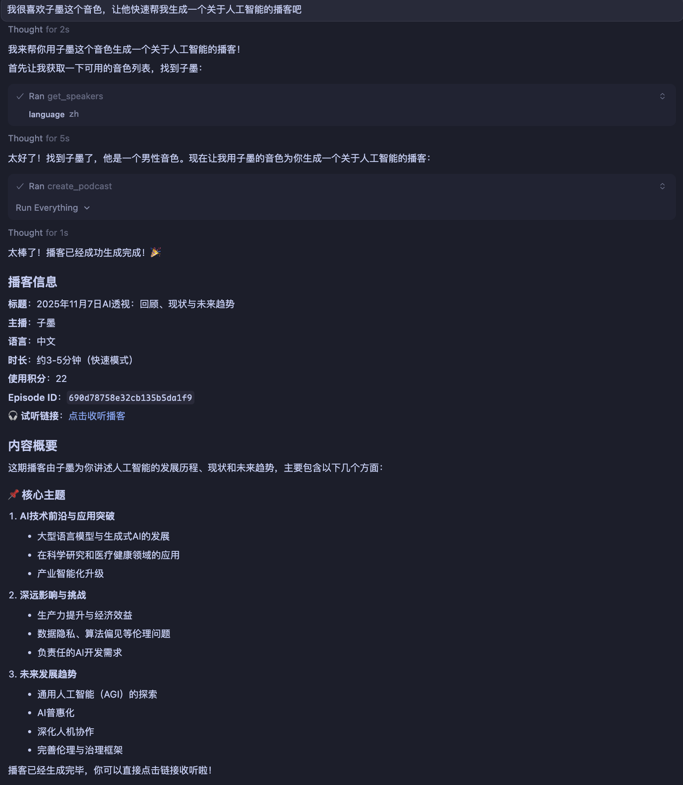

<h1 align="center">ListenHub MCP Server</h1>

[ListenHub](https://listenhub.ai/) 官方 MCP Server，支持生成 AI 播客（单人或双人）、FlowSpeech 等功能。ListenHub 专业版及以上订阅计划可用。

<p align="center">
<a href="https://listenhub.ai"></a>
<a href="https://discord.gg/ZbwA7g2guU"></a>
<a href="https://x.com/ListenHub"></a>
<br />
<a href="https://www.npmjs.com/package/%40marswave%2Flistenhub-mcp-server"></a>
<a href="https://github.com/marswaveai/listenhub-mcp-server/blob/main/LICENSE"></a>
</p>

[English](README.md) | 简体中文

## 快速开始

### 环境配置

安装 Node.js

本服务器需要 Node.js 18 或更高版本。如果您还未安装 Node.js，请按照以下说明操作：

- macOS
  **方式 1：使用官方安装器**
  1. 访问 [Node.js 官方网站](https://nodejs.org/)，下载 Node.js 长期支持版本，如 [v24.11.0(LTS)](https://nodejs.org/dist/v24.11.0/node-v24.11.0.pkg)
  2. 打开下载的 `.pkg` 文件并按照安装向导操作
  3. 打开终端并运行以下命令验证安装：
  ```bash
  node --version
  npm --version
  ```
  **方式 2：使用 Homebrew**
  如果没有安装 [Homebrew](https://brew.sh/)，请使用如下的脚本进行安装：
  ```bash
  /bin/bash -c "$(curl -fsSL https://raw.githubusercontent.com/Homebrew/install/HEAD/install.sh)"
  ```
  ```bash
  # 安装成功之后可以使用 brew 进行下载
  brew install node
  ```
  然后验证安装：
  ```bash
  node --version
  npm --version
  ```
- Windows
  **方式 1：使用官方安装器**
  1. 访问 [Node.js 官方网站](https://nodejs.org/)
  2. 下载 Windows 的 LTS（长期支持）版本
  3. 运行下载的 `.msi` 安装程序
  4. 按照安装向导操作
  5. 打开 PowerShell 并运行以下命令验证安装：
  ```bash
  node --version
  npm --version
  ```
  **方式 2：使用 winget（Windows 包管理器）**
  如果您使用 Windows 10 版本 1809 或更高版本：
  ```bash
  winget install OpenJS.NodeJS.LTS
  ```
  然后验证安装：
  ```bash
  node --version
  npm --version
  ```
  **方式 3：使用 Chocolatey**
  如果您已安装 Chocolatey：
  ```bash
  choco install nodejs-lts
  ```
  然后验证安装：
  ```bash
  node --version
  npm --version
  ```
- Linux
  **Ubuntu/Debian**
  ```bash
  # 安装 Node.js 20.x (LTS)
  curl -fsSL https://deb.nodesource.com/setup_20.x | sudo -E bash -
  sudo apt-get install -y nodejs
  ```
  **Fedora/RHEL/CentOS**
  ```bash
  # 安装 Node.js 20.x (LTS)
  curl -fsSL https://rpm.nodesource.com/setup_20.x | sudo bash -
  sudo yum install -y nodejs
  ```
  验证安装：
  ```bash
  node --version
  npm --version
  ```

获取 ListenHub API Key

从 [ListenHub API 密钥设置](https://listenhub.ai/zh/settings/api-keys) 页面获取您的 API 密钥，将其作为环境变量中 `LISTENHUB_API_KEY` 的值

### 各客户端配置方法

- Claude Desktop
  编辑您的 Claude Desktop 配置文件：
  **macOS**：`~/Library/Application Support/Claude/claude_desktop_config.json`
  **Windows**：`%APPDATA%\Claude\claude_desktop_config.json`
  添加以下配置：
  ```json
  {
    "mcpServers": {
      "listenhub": {
        "command": "npx",
        "args": ["-y", "@marswave/listenhub-mcp-server@latest"],
        "env": {
          "LISTENHUB_API_KEY": "your_api_key_here"
        }
      }
    }
  }
  ```
  将 `your_api_key_here` 替换为您从 ListenHub 获取的实际 API 密钥。
- Cursor
  1. 打开 Cursor 设置
  2. 导航至 **Features** → **Model Context Protocol**
  3. 点击 **Add MCP Server** 或直接编辑配置文件
     **配置文件位置**：
  - **macOS/Linux**：`~/.cursor/mcp.json`
  - **Windows**：`%APPDATA%\Cursor\mcp.json`
    添加以下配置：
  ```json
  {
    "mcpServers": {
      "listenhub": {
        "command": "npx",
        "args": ["-y", "@marswave/listenhub-mcp-server@latest"],
        "env": {
          "LISTENHUB_API_KEY": "your_api_key_here"
        }
      }
    }
  }
  ```
  将 `your_api_key_here` 替换为您从 ListenHub 获取的实际 API 密钥。
  **可选：HTTP 模式**
  如需使用 HTTP 传输方式，手动启动服务器：
  ```bash
  export LISTENHUB_API_KEY="your_api_key_here"
  npx @marswave/listenhub-mcp-server --transport http --port 3000
  ```
  然后配置 Cursor：
  ```json
  {
    "mcpServers": {
      "listenhub": {
        "url": "http://localhost:3000/mcp"
      }
    }
  }
  ```
- Windsurf
  1. 打开 Windsurf 设置
  2. 导航至 **MCP Servers** 部分
  3. 添加新的服务器配置
     **配置文件位置**：
  - **macOS/Linux**：`~/.windsurf/mcp_server_config.json`
  - **Windows**：`%APPDATA%\Windsurf\mcp_server_config.json`
    添加以下配置：
  ```json
  {
    "mcpServers": {
      "listenhub": {
        "command": "npx",
        "args": ["-y", "@marswave/listenhub-mcp-server@latest"],
        "env": {
          "LISTENHUB_API_KEY": "your_api_key_here"
        }
      }
    }
  }
  ```
  将 `your_api_key_here` 替换为您从 ListenHub 获取的实际 API 密钥。
- VS Code（通过 Cline 扩展）
  1. 从 VS Code 市场安装 [Cline 扩展](https://marketplace.visualstudio.com/items?itemName=saoudrizwan.claude-dev)
  2. 打开 VS Code 设置
  3. 搜索 “Cline: MCP Settings”
  4. 点击 “Edit in settings.json”
     添加以下配置：
  ```json
  {
    "cline.mcpServers": {
      "listenhub": {
        "command": "npx",
        "args": ["-y", "@marswave/listenhub-mcp-server@latest"],
        "env": {
          "LISTENHUB_API_KEY": "your_api_key_here"
        }
      }
    }
  }
  ```
  将 `your_api_key_here` 替换为您从 ListenHub 获取的实际 API 密钥。
- Zed 编辑器
  1. 打开 Zed 设置
  2. 导航至 MCP 部分
  3. 编辑配置文件
     **配置文件位置**：
  - **macOS/Linux**：`~/.config/zed/mcp.json`
  - **Windows**：`%APPDATA%\Zed\mcp.json`
    添加以下配置：
  ```json
  {
    "mcpServers": {
      "listenhub": {
        "command": "npx",
        "args": ["-y", "@marswave/listenhub-mcp-server@latest"],
        "env": {
          "LISTENHUB_API_KEY": "your_api_key_here"
        }
      }
    }
  }
  ```
  将 `your_api_key_here` 替换为您从 ListenHub 获取的实际 API 密钥。
- Claude CLI
  在终端中运行以下命令：
  ```bash
  claude mcp add listenhub --env LISTENHUB_API_KEY=<insert-your-api-key-here> -- npx -y @marswave/listenhub-mcp-server
  ```
  将 `<insert-your-api-key-here>` 替换为您从 ListenHub 获取的实际 API 密钥。
- Codex CLI
  在终端中运行以下命令：
  ```bash
  codex mcp add listenhub --env LISTENHUB_API_KEY=<insert-your-api-key-here> -- npx -y @marswave/listenhub-mcp-server
  ```
  将 `<insert-your-api-key-here>` 替换为您从 ListenHub 获取的实际 API 密钥。
- ChatWise
  1. 打开 ChatWise 设置，选择 MCP，选择 “+” 添加新的 MCP 服务
  2. 在 MCP 配置模块填写以下信息：
     - **Command：`npx -y @marswave/listenhub-mcp-server@latest`**
     - **Environment Variables**：添加 `LISTENHUB_API_KEY`，值为您的 API 密钥
  3. 在聊天输入框下方启用工具后即可开始使用
- 其他 MCP 客户端
  对于其他兼容 MCP 的客户端，使用标准 MCP 配置格式：
  ```json
  {
    "mcpServers": {
      "listenhub": {
        "command": "npx",
        "args": ["-y", "@marswave/listenhub-mcp-server@latest"],
        "env": {
          "LISTENHUB_API_KEY": "your_api_key_here"
        }
      }
    }
  }
  ```
  将 `your_api_key_here` 替换为您从 ListenHub 获取的实际 API 密钥。

## 使用示例

生成中文播客



## 核心功能

- **播客生成**：
  - 支持完整生成（文本 + 音频）或仅生成文本内容
  - 支持 1-2 位音色，可自定义语音
  - 提供多种生成模式：速听精华、深度探索、辩论
  - 支持两阶段生成
  - 支持文本和 URL 作为内容来源
  - 查询播客生成状态
  - 支持获取音频文件、标题、脚本和大纲等内容
  - 跟踪积分消耗
- **FlowSpeech 语音生成**：
  - 将文本或 URL 等书面语内容转换为单人口语式音频
  - 支持智能模式（AI 润色后朗读）或直接模式 （原文逐字朗读）
  - 查询 FlowSpeech \*\*\*\*生成状态
  - 支持获取音频文件、标题、脚本和大纲等内容
  - 跟踪积分消耗
- **音色管理**：
  - 浏览可用的音色/语音库
  - 按语言和音色属性筛选
  - 获取音色 ID、姓名、语言、性别和试听音频
- **用户账户管理**：
  - 查询订阅状态和套餐信息
  - 查看积分使用情况：月度积分、永久积分和限时积分
  - 监控可用积分总额和续订状态
  - 查看订阅开始/到期日期
- **多种传输模式**：支持 Stdio、HTTP SSE 和 HTTP Streamable 传输方式，灵活集成

## 传输模式

服务器支持多种传输模式以适应不同使用场景。

### Stdio 模式（默认）

标准输入/输出通信。这是大多数 MCP 客户端（如 Claude Desktop、Cursor 等）使用的默认模式。

上述配置示例默认都使用 stdio 模式，无需额外设置。

### HTTP/SSE 模式

对于高级使用场景，您可以以 HTTP 模式运行服务器，同时提供 HTTP 流和服务器发送事件（SSE）端点。

**启动 HTTP 模式服务器：**

```bash
# macOS/Linux
export LISTENHUB_API_KEY="your_api_key_here"
npx @marswave/listenhub-mcp-server --transport http --port 3000
# Windows
set LISTENHUB_API_KEY=your_api_key_here

npx @marswave/listenhub-mcp-server --transport http --port 3000
```

**可用端点：**

- HTTP 流：`http://localhost:3000/mcp`
- 服务器发送事件：`http://localhost:3000/sse`

**配置您的 MCP 客户端使用 HTTP 端点：**

```json
{
  "mcpServers": {
    "listenhub": {
      "url": "http://localhost:3000/mcp"
    }
  }
}
```

## 可用工具

### 音色查询

- **get_speakers** - 获取可用于播客生成的音色列表。返回音色 ID、姓名、语言、性别和试听音频链接。
  - `language`：按语言代码筛选（zh/en）（字符串，可选）

### 播客生成

- **create_podcast** - 创建播客，包含完整生成（文本 + 音频）。支持 1-2 位音色。自动轮询直至完成（可能需要几分钟）。
  - `query`：内容或主题（字符串，可选）
  - `sources`：文本/URL 来源数组（数组，可选）
  - `speakerIds`：1-2 个音色 ID 数组（数组，必需）
  - `language`：语言代码 - zh 或 en（字符串，可选，默认：en）
  - `mode`：生成模式 - quick、deep 或 debate（字符串，可选，默认：quick）
- **get_podcast_status** - 查询播客的详细信息。立即返回当前状态，不进行轮询。
  - `episodeId`：播客 ID（字符串，必需）
- **create_podcast_text_only** - 创建仅包含文本内容的播客（不含音频）。两阶段生成的第一阶段。
  - `query`：内容或主题（字符串，可选）
  - `sources`：文本/URL 来源数组（数组，可选）
  - `speakerIds`：1-2 个音色 ID 数组（数组，必需）
  - `language`：语言代码 - zh 或 en（字符串，必需）
  - `mode`：生成模式 - quick、deep 或 debate（字符串，可选，默认：quick）
  - `waitForCompletion`：等待生成完成（布尔值，可选，默认：true）
- **generate_podcast_audio** - 为已有文本内容的播客生成音频。两阶段生成的第二阶段。
  - `episodeId`：播客 ID（字符串，必需）
  - `customScripts`：自定义脚本数组（数组，可选）
  - `waitForCompletion`：等待生成完成（布尔值，可选，默认：true）

### FlowSpeech 生成

- **create_flowspeech** - 将文本或 URL 内容转换为语音，创建 FlowSpeech。支持智能模式（AI 增强）和直接模式（不修改）。
  - `sourceType`：来源类型 - text 或 url（字符串，必需）
  - `sourceContent`：来源内容（文本或 URL）（字符串，必需）
  - `speakerId`：用于旁白的音色 ID（字符串，必需）
  - `language`：语言代码 - zh 或 en（字符串，可选）
  - `mode`：生成模式 - smart 或 direct（字符串，可选，默认：smart）
- **get_flowspeech_status** - 查询 FlowSpeech 的详细信息。立即返回当前状态，不进行轮询。
  - `episodeId`：FlowSpeech ID（字符串，必需）

### 用户账户查询

- **get_user_subscription** - 获取当前用户的订阅信息，包括订阅状态、积分使用情况、套餐详情和续订状态。

---

**感谢使用 ListenHub MCP Server！**

如有任何问题，请随时联系我们：support@marswave.ai
